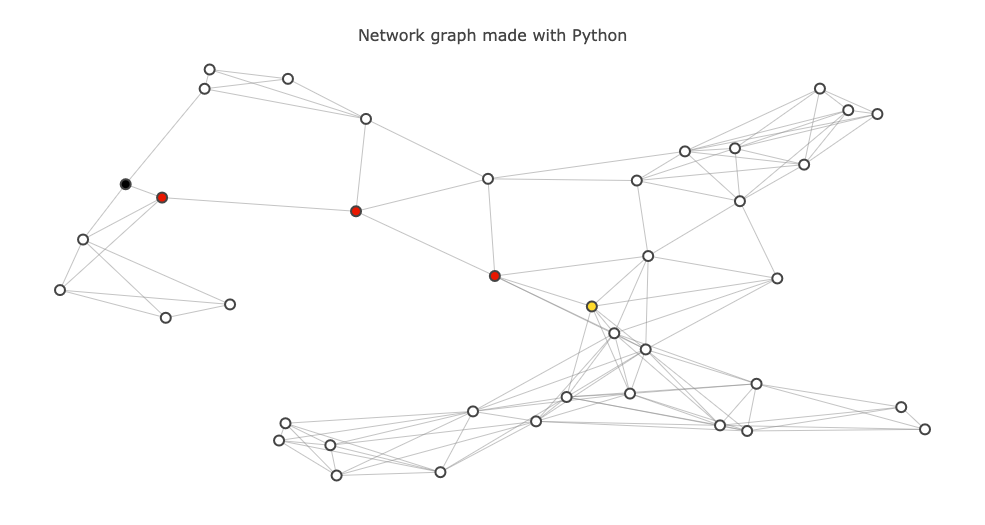

# Route Planning Project

This repo contains the starter code for the Route Planning project.

The project build a route-planning algorithm like the one used in Google Maps using A* search to calculate the shortest path between two points on a map.




## Cloning

To clone this project:
```
git clone https://github.com/JcFreya/UD-DSA-proj3-route-planner.git
```

## Project Requirements

To run this project you will need:

- Python 3
- Jupyter notebook
- networkx
- plotly]


## Running

### Intro
Open the jupyter notebook `project_notebook.ipynb`. 	`show_map()` function shows a network of intersections within the input. The edge between 2 nodes(intersections) represents a literal straight road not just an abstract connection of 2 cities.

These `Map` objects have two properties you will want to use to implement A\* search: `intersections` and `roads`

**Intersections**
The `intersections` are represented as a dictionary.

**Roads**
The `roads` property is a list where, if `i` is an intersection, `roads[i]` contains a list of the intersections that intersection `i` connects to.


### Advanced Visualizations
The `show_map` function which generated this map also takes a few optional parameters which might be useful for visualizaing the output of the search algorithm you will write.

* `start` - The "start" node for the search algorithm.
* `goal`  - The "goal" node.
* `path`  - An array of integers which corresponds to a valid sequence of intersection visits on the map.

### Algorithm
The algorithm code is located in `student_code.py`.  

The algorithm is responsible for generating a `path` like the one passed into `show_map` . `shortest_path(M,start,goal)` will generate the shortest path from start to goal.

```bash
> shortest_path(map_40, 5, 34)
[5, 16, 37, 12, 34]
```


## Testing

For testing, run the last cell
```
from test import test
test(shortest_path)
```
in `project_notebook.ipynb`. If the code produces no errors, then the algorithm is behaving correctly.
